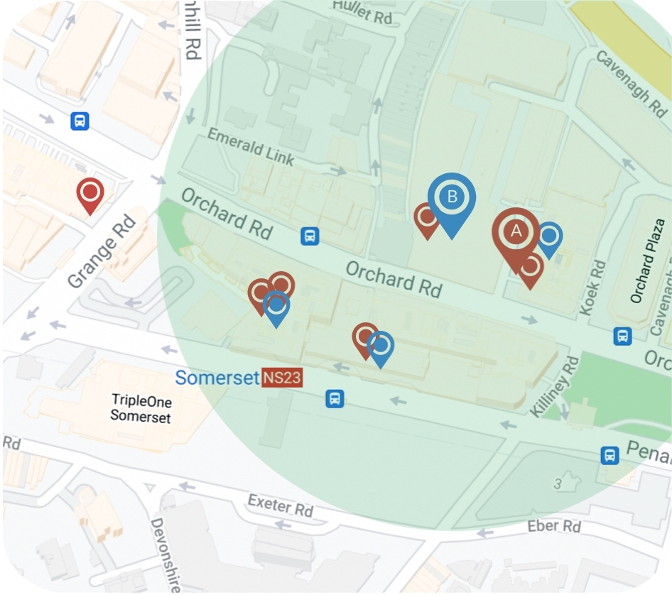

# Geo-ER
### Code for 'Geospatial Entity Resolution' paper (WWW 2022)

Geo-ER is an Entity Resolution (ER) framework to match geospatial entities. It allows to integrate geospatial databases, performing deduplication of the entries. Geo-ER leverages Transformer-based Language Models (LMs), Distance embedding, and a novel Neighbourhood attention component, based on Graph Attention (GAT).

### Requirements

* Python 3.7.7
* PyTorch 1.9
* HuggingFace Transformers 4.9.2

Install required packages
```
pip install -r requirements.txt
```

### Geospatial ER

The following image (left) depicts an example of Geospatial ER, in which two sources are being joined. Geo-ER uses textual information, distance and spatial neighbours information (right) to infer if two records, from the two sources, refer to the same real-world entity.



Each entity is pre-serialized as follows:

```
COL name VAL Wine and Spirits COL latitude VAL 40.4535 COL longitude VAL -80.009 COL address VAL Ohio Street COL postalCode VAL NULL
```

Each entity pair ``<e_1, e_2>`` is serialized as follows:

```
<e_1> \t <e_2> \t <label>
```
where ``<e_i>`` is the serialized version of entity ``i`` and ``<label>`` is the either ``0`` (no-match) or ``1`` (match).
